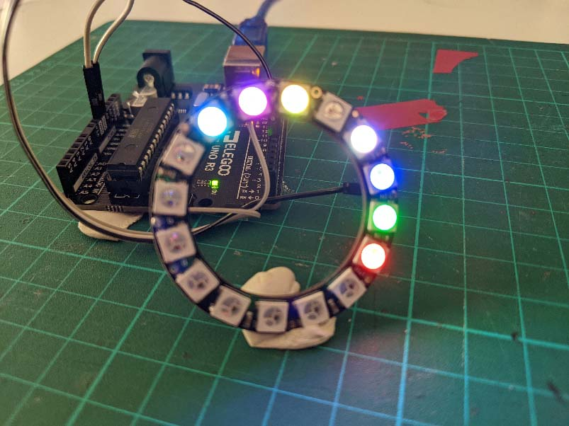

# arduino_led_animation

A crash course focused on led animation with arduino for designers

Dans ce document nous allons nous concentrer sur la création d'animations basées sur une timeline qui se joueront sur des leds de type neopixels; comme présenté ci-dessous :

GIF à Intégrer

Cette ressource n'a pas vocation à être une introduction à arduino, vous pourrez trouver une ressource plus générale sur arduino et suivant ce lien : https://github.com/b2renger/Introduction_Arduino

Il peut-être intéressant de lire l'introduction du lien ci-dessus si vous ne connaissez absolument pas arduino avant de continuer; notament si vous souhaitez découvrir l'anatomie d'une carte arduino, les principes de base des broches d'entrée et sortie, ainsi que le logiciel permettant de programmer les cartes.


## Brancher un anneau ou ruban de Leds

Il faut comprendre qu'un anneau de leds consomme du courant et qu'une carte arduino ne peut fournir qu'une certaine quantité de courant, et donc à partir d'un certain nombre il faudra avoir recours à une alimentation externe. Mais nous détaillerons ça plus tard.

Commençons donc par brancher notre premier anneau, directement sur la carte :


Nous pouvons maintenant ouvrir le logiciel [arduino](https://www.arduino.cc/en/software), afin de programmer !

### Installation de la bibliothèque

Afin de pouvoir adresser des couleurs aux leds il faut utiliser une bibliothèque logicielle dédiée au type de leds utiliser.

Il faut donc l'installer via **le gestionnaire de bibliothèques**, accessible depuis le menu *Croquis* -> *Inclure une bibliothèque* -> *Gérer les bibliothèques*.


Puis, dans le champ de recherche taper "neopixels" et choisir la bibliothèque *Adafruit NeoPixel*


### Programmer les leds manuellement

Pour commencer à produire de la lumière le plus simple est d'adresser les leds manuellement en utilisant l'index de la led que nous voulons éclairer. L'index étant un chiffre correspondant au numéro de la led sur l'anneau.


```c
// inclure la bibliothèque nécessaire
#include <Adafruit_NeoPixel.h>

// initialiser l'anneau de leds avec 16 leds connectés sur la pin 6
#define NUMPIXELS 16

Adafruit_NeoPixel ring1 = Adafruit_NeoPixel(NUMPIXELS, 6, NEO_GRB + NEO_KHZ800); 
// notre anneau est maintenant représenté par l'alias "ring1"

void setup() {
  // intialiser l'anneau  
  ring1.begin(); 
}

void loop() {
    // donner une couleur à certains pixels en RGB (max = 255)
    // 0 -> rouge
    ring1.setPixelColor(0, ring1.Color(255, 0, 0)); 

    // 1 -> vert
    ring1.setPixelColor(1, ring1.Color(0, 255, 0)); 
    // 2 -> bleu
    ring1.setPixelColor(2, ring1.Color(0, 0, 255));
    // 3 -> blanc
    ring1.setPixelColor(3, ring1.Color(255, 255, 255)); 
    // 4 -> noir
    ring1.setPixelColor(4, ring1.Color(0, 0, 0)); // noir
    // 5 -> jaune
    ring1.setPixelColor(5, ring1.Color(255, 255, 0));
    // 6 -> rose
    ring1.setPixelColor(6, ring1.Color(255, 0, 255));
    // 7 -> turquoise
    ring1.setPixelColor(6, ring1.Color(0, 255, 255));
    // on actualise le ruban de led 
    ring1.show(); 
}
```

Vous devriez alors obtenir ce résultat :


### Utiliser une boucle pour assigner toutes les leds

### Le mode de couleur HSB


## La bibliothèque Tween

### Timeline

### Les transitions RGB vs HSB


## Programmation avancée

### Animation radiale

### Noise


## Brancher et assigner plusieurs anneaux


## Branchement avec une alimentation externe

